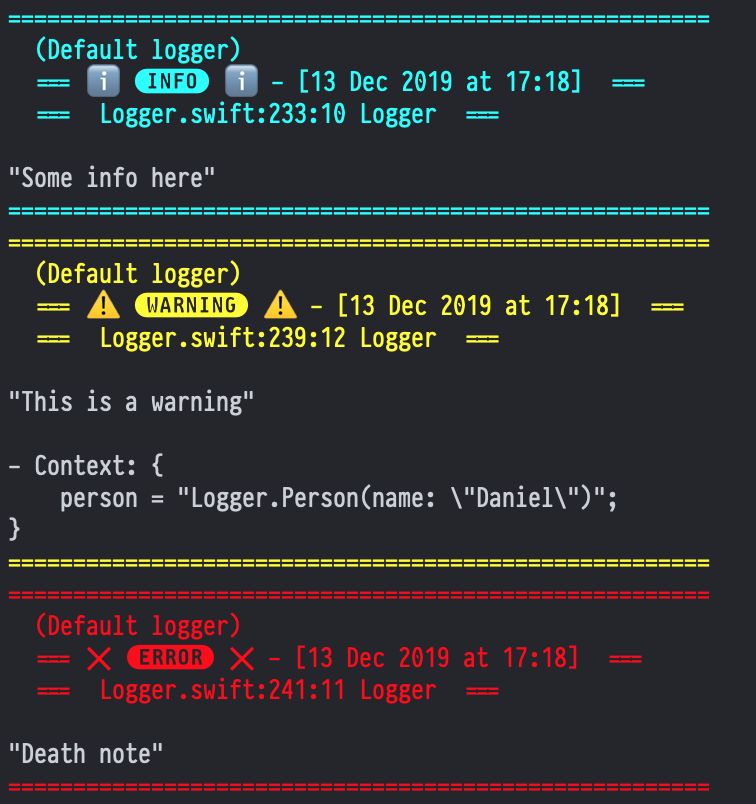
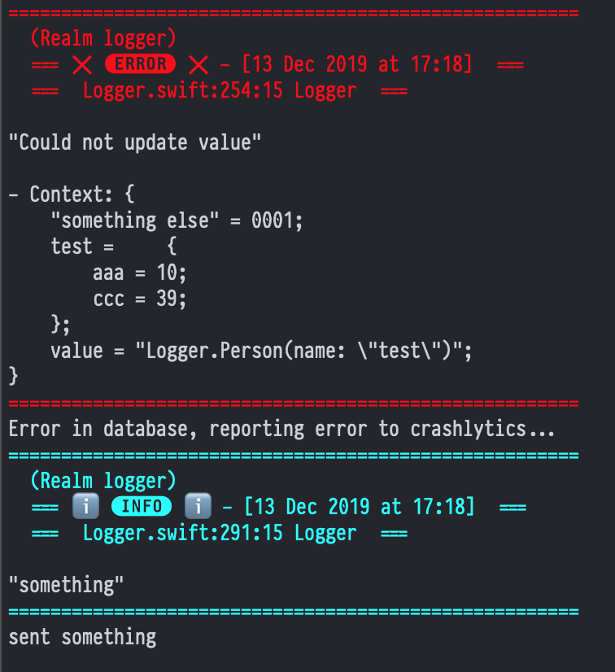

# BetterLogger

## Instructions
Use Swift package manager addding this git: https://github.com/illescasDaniel/BetterLogger.git

> `BetterLogger.swift.gyb` uses [apple/swift/gyb.py](https://github.com/apple/swift/blob/master/utils/gyb.py) file to generate some code. [GYB usage here](https://nshipster.com/swift-gyb/).
If you want to edit `BetterLogger.swift.gyb` and generate the swift file, just download [gyb.py](https://github.com/apple/swift/blob/master/utils/gyb.py) and copy it inside this folder, then run `generate.sh`.

## Examples

- ### **Simple usage**:

```swift
// easy way to use the default logger instance
var log: BetterLogger { BetterLogger.default }

log.info("Some info here")

struct Person {
    let name: String
}

log.warning("This is a warning", context: ["person": Person(name: "Daniel")])

log.error("Death note")
```

- ### **Advanced usage**:

```swift
// custom loggers
let realmLog = BetterLogger(name: "Realm")

// trigger actions for log events
realmLog.listeners[.error] = {
    // ...
    print("Error in database, reporting error to crashlytics...")
}

realmLog.error(
    "Could not update value",
    context: [
        "value": Person(name: "test"),
        "something else": "0001",
        "test": [
            "aaa": 10,
            "ccc": 39
        ]
    ]
)

// Custom handlers for logs

public struct CrashlyticsLoggerOutputFormatter: LoggerOutputFormatter {
    public func stringRepresentationFrom(_ parameters: BetterLogger.Parameters) -> String {
        return String(describing: parameters.value)
    }
}
public struct CrashlyticsLoggerHandler: LoggerHandler {
    public var formatter: LoggerOutputFormatter = CrashlyticsLoggerOutputFormatter()
    public func log(_ parameters: BetterLogger.Parameters) {
        sendError(
            message: formatter.stringRepresentationFrom(parameters)
        )
    }
}
func sendError(message: String) {
    // ...
    print("sent \(message)")
}

// handlers is just [ConsoleLoggerHandler()] by default, here we add our custom handler
realmLog.handlers.append(
    CrashlyticsLoggerHandler()
)

realmLog.info("something")
```

## Screenshots (default console output):




